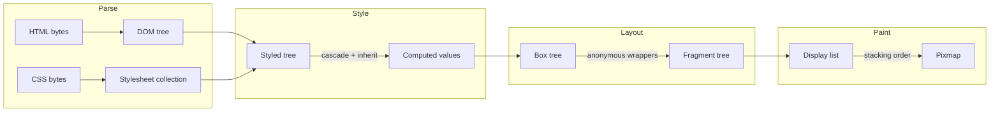
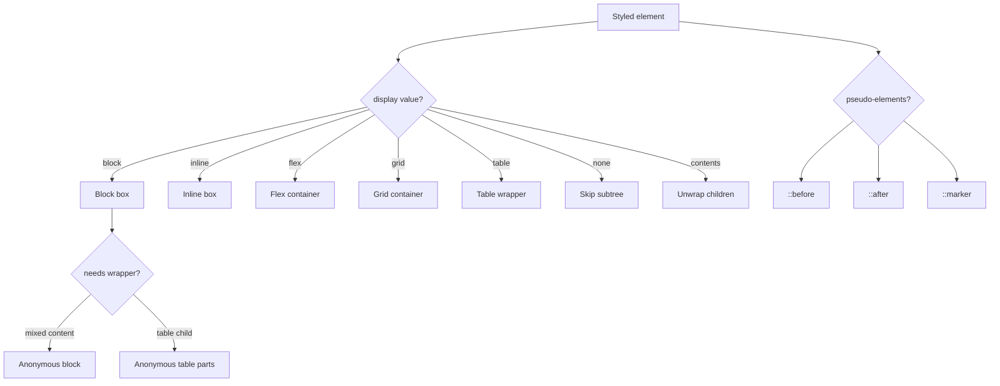
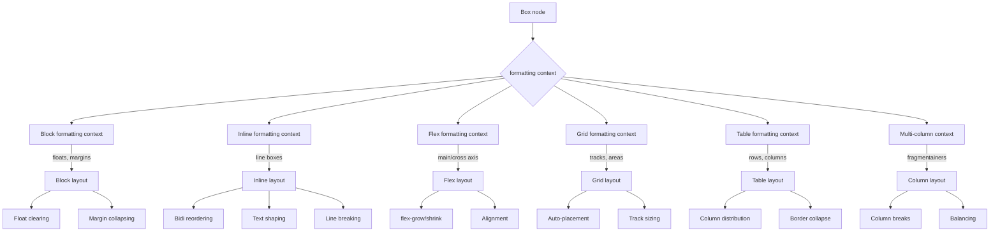
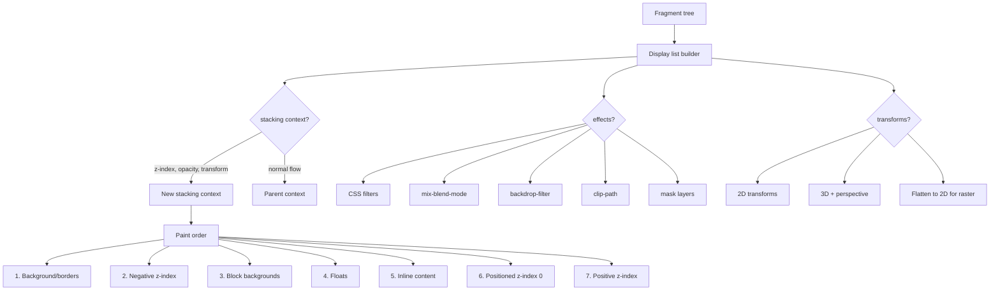
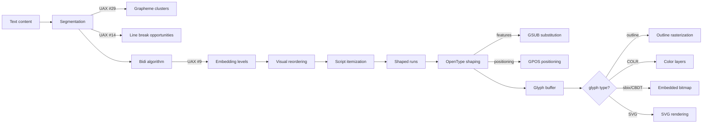
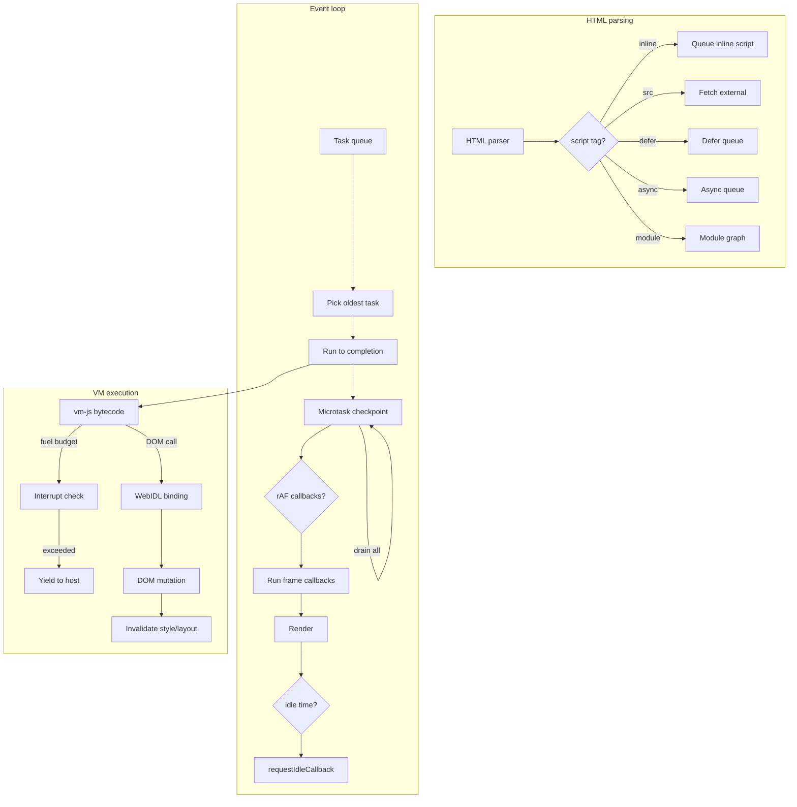
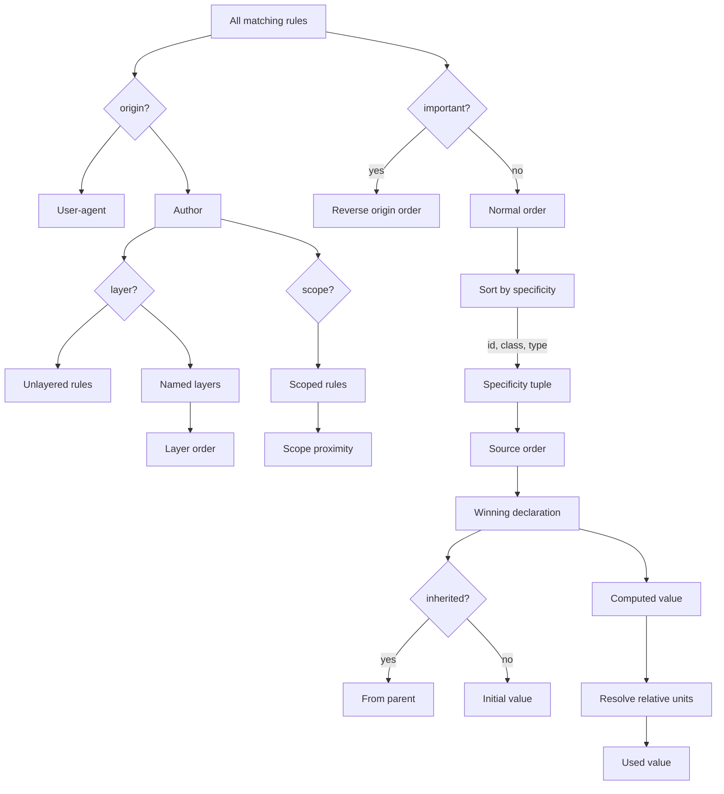
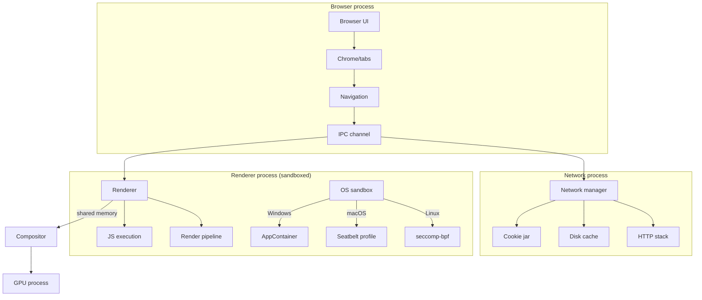

# FastRender

A browser rendering engine in Rust. Parses HTML/CSS, computes styles, performs layout, and paints pixels. Includes a desktop browser shell and JavaScript execution via an embedded JS engine.

Under heavy development. APIs are unstable and change frequently. Not recommended for production use.

Developed as part of [research into collaborative parallel AI coding agents](https://cursor.com/blog/scaling-agents).

## Repository structure

```
src/
├── api.rs                 # Public API (FastRender, RenderOptions)
├── dom.rs                 # DOM tree, parsing, shadow DOM
├── dom2/                  # Live DOM for JS mutation
├── css/                   # CSS parsing, selectors, values
├── style/                 # Cascade, computed styles, media queries
│   ├── cascade.rs         # Cascade algorithm, layers, scope
│   ├── properties.rs      # Property definitions
│   └── values.rs          # Value types, calc(), colors
├── tree/                  # Box tree generation
│   ├── box_tree.rs        # Box nodes, formatting contexts
│   ├── box_generation.rs  # Styled → box mapping
│   └── table_fixup.rs     # Anonymous table wrapper insertion
├── layout/                # Layout algorithms
│   ├── contexts/
│   │   ├── block/         # Block formatting context
│   │   ├── inline/        # Inline formatting, line boxes
│   │   ├── flex.rs        # Flexbox
│   │   └── grid.rs        # CSS Grid
│   ├── table.rs           # Table layout (auto + fixed)
│   ├── fragmentation.rs   # Pagination, column breaks
│   └── absolute_positioning.rs
├── text/                  # Text processing
│   ├── pipeline.rs        # Itemization, shaping, layout
│   ├── bidi.rs            # Bidirectional algorithm
│   ├── line_break.rs      # Line breaking, hyphenation
│   └── color_fonts/       # COLR, sbix, SVG-in-OT
├── paint/                 # Painting
│   ├── display_list.rs    # Display list structure
│   ├── stacking.rs        # Stacking contexts, z-order
│   ├── painter.rs         # Rasterization
│   └── svg_filter.rs      # CSS/SVG filter effects
├── js/                    # JavaScript integration
│   ├── event_loop.rs      # Task queues, microtasks
│   ├── html_script_*.rs   # Script loading, execution
│   ├── vmjs/              # vm-js bindings
│   └── import_maps/       # ES module import maps
├── ui/                    # Desktop browser UI
│   ├── browser_app.rs     # Window, tabs, chrome
│   ├── render_worker.rs   # Background rendering
│   └── messages.rs        # UI ↔ worker protocol
├── sandbox/               # OS sandboxing
│   ├── linux_seccomp.rs   # seccomp-bpf filters
│   ├── macos_seatbelt.rs  # Seatbelt profiles
│   └── windows.rs         # AppContainer
├── resource/              # Network, caching
│   ├── disk_cache.rs      # On-disk asset cache
│   └── web_fetch/         # Fetch API implementation
└── bin/                   # CLI binaries

vendor/
├── ecma-rs/               # JavaScript engine (vm-js)
└── taffy/                 # Flexbox/Grid layout

tests/
├── integration.rs         # Integration test harness
├── pages/fixtures/        # Offline page captures
└── wpt/                   # Web Platform Tests subset

docs/                      # Internal documentation
instructions/              # Workstream guides
progress/pages/            # Pageset accuracy tracking
```

---

## Rendering pipeline



Each stage produces an immutable tree consumed by the next. This separation enables caching: change only CSS and re-cascade without re-parsing HTML; scroll without re-laying-out.

### Box generation



The box tree is not 1:1 with the DOM. `display: contents` removes an element's box while keeping its children. Tables generate anonymous row/cell wrappers per CSS 2.1 §17.2. Mixed block/inline children trigger anonymous block box creation.

### Layout contexts



Layout is recursive: a flex container lays out its items, each of which may establish its own formatting context. Block and inline contexts are implemented natively. Flexbox and grid delegate to a vendored layout library (Taffy). Tables use a native implementation with bidirectional constraint solving for auto layout.

**Block formatting context**: Floats, margin collapsing, `clear`. Floats interact with line boxes — text wraps around floated elements. Margin collapsing follows CSS 2.1 rules including the many edge cases (empty blocks, clearance, negative margins).

**Inline formatting context**: Line box construction, baseline alignment, bidirectional text. Text is shaped into glyph runs, then broken into lines respecting `word-break`, `overflow-wrap`, `hyphens`. Bidi reordering happens after line breaking.

**Table layout**: Column width distribution with `table-layout: auto` requires measuring content, distributing excess space proportionally, and respecting min/max constraints. Border collapsing follows CSS 2.1 §17.6 conflict resolution.

**Multi-column**: Content flows through column fragmentainers. Column breaks respect `break-before`/`break-after`/`break-inside`. Balancing attempts to equalize column heights.

### Paint order



Stacking contexts isolate z-ordering. Elements with `opacity < 1`, `transform`, `filter`, or explicit `z-index` on positioned elements create new stacking contexts. Paint order within a context follows CSS 2.1 Appendix E.

3D transforms with `perspective` are supported but flattened to 2D for the software rasterizer. `transform-style: preserve-3d` is partially supported.

---

## Text pipeline



Text rendering involves:

1. **Segmentation**: Split text at script boundaries, identify grapheme clusters (UAX #29) and line break opportunities (UAX #14).

2. **Bidi**: Run the Unicode Bidirectional Algorithm (UAX #9) to determine embedding levels. Mixed LTR/RTL text gets reordered for visual display.

3. **Shaping**: OpenType shaping via RustyBuzz applies GSUB substitutions (ligatures, contextual alternates) and GPOS positioning (kerning, mark placement). Complex scripts like Arabic and Devanagari require shaping for correct rendering.

4. **Line breaking**: Break shaped runs into lines respecting available width, `word-break`, `overflow-wrap`, and soft hyphens. `hyphens: auto` uses language-specific hyphenation dictionaries.

5. **Color fonts**: Glyphs may be outlines (rasterized normally), COLR layers (multiple colored paths), sbix/CBDT bitmaps (embedded PNGs), or SVG (rendered via resvg). COLR v1 supports gradients and blend modes.

---

## JavaScript integration



JavaScript execution follows the HTML spec's processing model:

**Script loading**: Parser-inserted scripts block parsing until executed. `defer` scripts run after parsing in document order. `async` scripts run when ready. Module scripts build a dependency graph and execute after all imports resolve.

**Event loop**: Tasks (timers, network callbacks, user events) are queued and executed one at a time. After each task, the microtask queue drains completely (Promise reactions, `queueMicrotask`). Frame callbacks (`requestAnimationFrame`) run before rendering. Idle callbacks (`requestIdleCallback`) run when the event loop has spare time.

**Budgeting**: The VM (vm-js) uses fuel-based budgeting. Each operation consumes fuel; when fuel exhausts, execution yields to the host. This prevents infinite loops from hanging the browser. Wall-time limits provide a secondary bound.

**DOM bindings**: Web IDL bindings expose DOM APIs to JavaScript. DOM mutations trigger style/layout invalidation. The binding layer is incomplete — many methods are stubbed and throw. Coverage is growing.

**Import maps**: `<script type="importmap">` is supported. Module specifier resolution goes through the import map before URL resolution.

---

## CSS cascade



The cascade implements CSS Cascade Level 4:

**Origins**: User-agent styles (browser defaults) < author styles. `!important` reverses the order.

**Layers**: `@layer` groups rules into named layers. Layer order is determined by first appearance. Unlayered rules beat layered rules (within the same origin).

**Scope**: `@scope` limits rule applicability to a subtree. Scope proximity breaks ties when multiple scoped rules match.

**Specificity**: (id count, class/attribute/pseudo-class count, type/pseudo-element count). Higher specificity wins.

**Custom properties**: `--custom` properties participate in the cascade and inherit by default. `var(--x, fallback)` substitution happens at computed-value time.

**Container queries**: `@container` rules match based on ancestor container size or style. Style queries can test custom property values.

---

## Multiprocess architecture (target)



This is the target architecture. Currently the browser runs the renderer on a worker thread within the same process.

Sandbox helpers exist and are tested:
- **Linux**: seccomp-bpf denies filesystem opens, network socket creation, and exec. Landlock provides optional filesystem restriction.
- **macOS**: Seatbelt profiles restrict filesystem and network access.
- **Windows**: AppContainer with zero capabilities; Job Objects enforce process limits.

The IPC layer (`src/ipc/`, `crates/fastrender-ipc/`) defines message protocols for navigation, resource loading, and frame transport. Shared memory frame buffers avoid copying pixel data.

---

## Build requirements

### All platforms

- Rust 1.70+ (stable)
- Git (submodules)
- CMake

### macOS

```bash
xcode-select --install
brew install cmake make
```

### Linux (Ubuntu/Debian)

```bash
sudo apt-get update
sudo apt-get install -y \
  build-essential pkg-config cmake clang lld \
  libasound2-dev libwayland-dev libxkbcommon-dev \
  libvulkan-dev libegl1-mesa-dev libx11-dev
```

## Building

Initialize submodules:

```bash
git submodule update --init vendor/ecma-rs
```

Build and run the browser:

```bash
cargo run --release --features browser_ui --bin browser
```

The `browser_ui` feature enables the desktop shell. Core renderer builds can omit this.

## Binaries

| Binary | Purpose |
|--------|---------|
| `browser` | Desktop browser with tabs, navigation, bookmarks |
| `fetch_and_render` | Fetch URL, render to PNG |
| `fetch_pages` | Cache pageset HTML |
| `prefetch_assets` | Warm subresource cache |
| `pageset_progress` | Render pageset, update accuracy scoreboard |
| `render_fixtures` | Render offline test fixtures |
| `bundle_page` | Capture page + subresources for offline replay |
| `inspect_frag` | Dump fragment tree, pipeline state |
| `dump_a11y` | Export accessibility tree as JSON |
| `diff_renders` | Pixel-diff two render outputs |

## Library API

```rust
use fastrender::FastRender;

let mut renderer = FastRender::new()?;
let pixmap = renderer.render_html("<h1>Hello</h1>", 800, 600)?;
pixmap.save_png("out.png")?;
```

For URL rendering with diagnostics:

```rust
use fastrender::{FastRender, RenderOptions, DiagnosticsLevel};

let mut renderer = FastRender::new()?;
let result = renderer.render_url_with_options(
    "https://example.com",
    RenderOptions::new()
        .with_diagnostics_level(DiagnosticsLevel::Basic)
        .allow_partial(true),
)?;

for error in &result.diagnostics.fetch_errors {
    eprintln!("{}: {}", error.url, error.message);
}
result.pixmap.save_png("example.png")?;
```

For live documents with JavaScript, use `BrowserTab` which provides an event loop, script execution, and incremental rendering. See `docs/runtime_stacks.md`.

## Conformance

| Spec | Status |
|------|--------|
| HTML5 parsing | Complete |
| CSS Selectors 4 | Complete |
| CSS Cascade 4 | Complete (layers, scope, custom properties) |
| CSS Grid 1 | Supported (subgrid maturing) |
| CSS Flexbox 1 | Complete |
| CSS Multi-column 1 | Complete |
| CSS Tables | Complete (auto + fixed layout) |
| CSS Transforms | 2D complete, 3D flattened to 2D |
| CSS Filters | Supported (subset of SVG filter graph) |
| CSS Animations | Supported (keyframes, transitions, scroll/view timelines) |
| CSS Container Queries | Supported (size + style queries) |
| CSS Fonts 4 | Supported (variations, features, color fonts) |
| CSS Text 3/4 | Supported (bidi, hyphenation, justification) |
| JavaScript | Partial (event loop, DOM subset, growing Web API surface) |
| ARIA / ACCNAME 1.2 | Supported (role mapping, name computation) |

See `docs/conformance.md` for the detailed matrix with implementation links.

## Testing

```bash
cargo test --lib                        # unit tests in src/
cargo test --test integration           # integration tests
cargo test --lib css::parser            # specific module
```

Unit tests live alongside code in `src/`. Integration tests are in `tests/integration.rs`. Paint regressions are in `src/paint/tests/`. WPT coverage is in `tests/wpt/`.

Test fixtures in `tests/pages/fixtures/` are self-contained page captures with all subresources inlined. Chrome-vs-FastRender diffs validate pixel accuracy against a reference browser.
